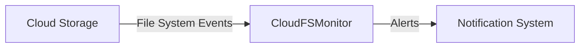

# CloudFSMonitor

A cloud-based file system monitor that provides real-time monitoring and alerts for file system changes, modifications, and deletions.

## Problem Statement
File system monitoring is crucial for ensuring data integrity and security in cloud environments.

## Why it Matters
Real-time monitoring and alerts enable prompt action to be taken in case of suspicious activity, reducing the risk of data breaches and losses.

## Architecture

## Project Structure
```
CloudFSMonitor/
|---- README.md
|---- CONTRIBUTING.md
|---- requirements.txt
|---- main.py
|---- src/
|       |---- cloud_storage.py
|       |---- file_system_monitor.py
|       |---- notification_system.py
```
## Installation Steps
1. Clone the repository: `git clone https://github.com/your-username/CloudFSMonitor.git`
2. Install dependencies: `pip install -r requirements.txt`
3. Configure cloud storage and notification system settings in `config.json`
## Quick Start
1. Run the application: `python main.py`
2. Monitor file system events and receive alerts in real-time
## Configuration
Cloud storage and notification system settings can be configured in `config.json`
## Design Decisions
* Cloud-based architecture for scalability and flexibility
* Real-time monitoring and alerts for prompt action
* Modular design for maintainability and extensibility
## Roadmap
* Integrate with multiple cloud storage providers
* Enhance security features with encryption and access controls
* Improve user interface for better usability
## Contribution
Pull requests and issues are welcome. Please follow the PR workflow and commit standards outlined in `CONTRIBUTING.md`
## License
MIT License